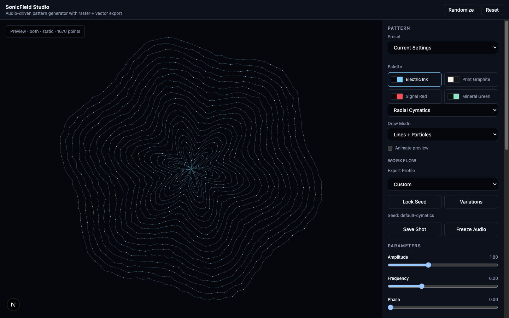
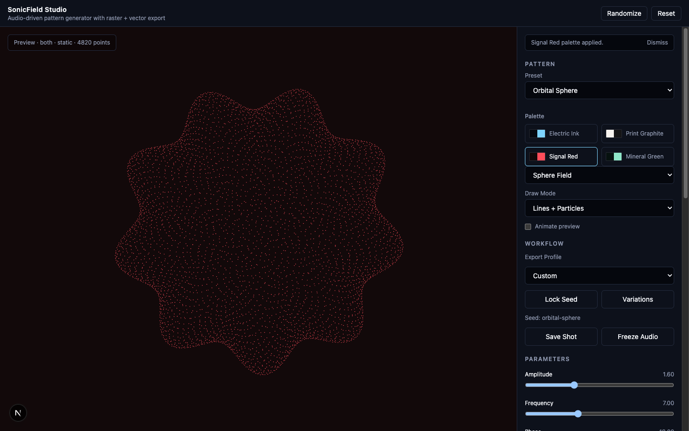
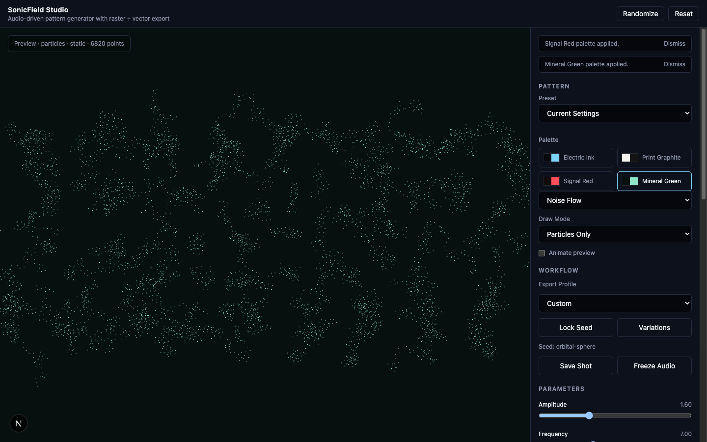

# SonicField Studio

**Audio-driven pattern generator with raster (PNG) and vector (SVG) export.**

[](LICENSE)
[](https://nextjs.org/)
[](https://www.typescriptlang.org/)

SonicField Studio is a Next.js + TypeScript app that renders cymatics-style geometric patterns from a shared simulation engine, previews them live on a WebGL canvas, and exports the exact same geometry as a raster PNG or a clean, editable SVG — no bitmap tracing involved.



## Table of Contents

- [Features](#features)
- [Screenshots](#screenshots)
- [How It Works](#how-it-works)
- [Tech Stack](#tech-stack)
- [Getting Started](#getting-started)
- [Available Scripts](#available-scripts)
- [Project Structure](#project-structure)
- [Documentation](#documentation)
- [Contributing](#contributing)
- [License](#license)

## Features

- **Shared simulation engine** — one source of truth for pattern geometry (points, paths, metadata) consumed by both renderers, so raster and vector output never drift apart.
- **5 pattern modes** — Wave Grid, Radial Cymatics, Lissajous, Sphere Field, Noise Flow.
- **3 draw modes** — Lines Only, Particles Only, or Lines + Particles.
- **Live parameter control** — amplitude, frequency, phase, speed, density, particle size, noise, symmetry, vector simplification, and path smoothing.
- **Curated palettes and presets** — Electric Ink, Print Graphite, Signal Red, Mineral Green, plus ready-made pattern presets.
- **Audio-reactive input** — drive the pattern with an oscillator, a loaded audio file, or the microphone.
- **Designer workflow tools** — lock seed, generate variations, freeze audio, export profiles (Poster 4:5, Square Social, Wide Wallpaper, Transparent Asset), and save/import JSON presets.
- **Raster export (PNG)** — configurable resolution, optional transparent background.
- **Vector export (SVG)** — native geometry export with sampling, simplification, path smoothing, and overlap-free particle export, guarded by a configurable node-count limit and warnings for overly dense scenes.

## Screenshots

| Radial Cymatics (Electric Ink) | Orbital Sphere (Signal Red) | Noise Flow — Particles Only (Mineral Green) |
| --- | --- | --- |
|  |  |  |

## How It Works

The **simulation engine** is the only layer allowed to decide geometry — it returns points, paths, metadata, and warnings. Renderers only draw or export that geometry:

- **Raster renderer** — realtime WebGL/Three.js preview, may add presentation-only effects (glow, blur, trails, particle depth) and smooth paths for display, but never invents new pattern logic.
- **Vector renderer** — generates native SVG (circles, paths, polylines, groups) straight from geometry, filters overlapping particles before sampling, and respects the selected draw mode. Screenshot-to-SVG and bitmap tracing are explicitly forbidden.

See [`docs/renderer-architecture.md`](docs/renderer-architecture.md) and [`docs/export-rules.md`](docs/export-rules.md) for the full contract.

## Tech Stack

- [Next.js 15](https://nextjs.org/) + [React 19](https://react.dev/)
- [TypeScript](https://www.typescriptlang.org/)
- [Three.js](https://threejs.org/) / [@react-three/fiber](https://docs.pmnd.rs/react-three-fiber) for the raster preview
- [Paper.js](http://paperjs.org/) / [Two.js](https://two.js.org/) for vector geometry
- [Zustand](https://zustand-demo.pmnd.rs/) for state management
- [Tailwind CSS](https://tailwindcss.com/) for UI styling
- [Vitest](https://vitest.dev/) for unit tests

## Getting Started

### Prerequisites

- Node.js 18.18 or newer
- npm

### Installation

```bash
git clone https://github.com/Elguajo/SonicField-Studio.git
cd SonicField-Studio
npm install
```

### Run the dev server

```bash
npm run dev
```

Open [http://localhost:3000](http://localhost:3000) in your browser.

## Available Scripts

| Command | Description |
| --- | --- |
| `npm run dev` | Start the Next.js development server |
| `npm run build` | Build the app for production |
| `npm run start` | Serve the production build |
| `npm run lint` | Run ESLint |
| `npm run test` | Run the Vitest test suite |
| `npm run typecheck` | Run the TypeScript compiler in check-only mode |

## Project Structure

```txt
app/                      Next.js app router entry point
src/
  components/              UI: TopBar, ControlPanel, Viewport
  lib/
    simulation/            Shared simulation engine (geometry source of truth)
    renderers/              Raster renderer, vector exporter, particle layout, path smoothing
    workflow/               Designer workflow (variations, seeds, export profiles)
    presets.ts               Built-in and JSON preset handling
  store/                    Zustand store (useStudioStore)
  types/                    Shared TypeScript types
docs/                      Architecture and export-rule documentation
specs/001-sonicfield-studio/  Spec Kit artifacts (spec, plan, tasks, data model, contracts)
```

## Documentation

This project follows the [GitHub Spec Kit](https://github.com/github/spec-kit) workflow. Detailed specs live under [`specs/001-sonicfield-studio/`](specs/001-sonicfield-studio/):

- [`spec.md`](specs/001-sonicfield-studio/spec.md) — feature specification
- [`plan.md`](specs/001-sonicfield-studio/plan.md) — implementation plan
- [`tasks.md`](specs/001-sonicfield-studio/tasks.md) — task breakdown
- [`data-model.md`](specs/001-sonicfield-studio/data-model.md) — data model
- [`contracts/`](specs/001-sonicfield-studio/contracts/) — preset and export JSON schemas

Architecture notes:

- [`docs/renderer-architecture.md`](docs/renderer-architecture.md) — simulation/renderer contract
- [`docs/export-rules.md`](docs/export-rules.md) — PNG/SVG/preset export rules and limits
- [`docs/product-vision.md`](docs/product-vision.md) — product vision

## Contributing

Issues and pull requests are welcome. Before opening a PR, please make sure:

```bash
npm run lint
npm run typecheck
npm run test
```

all pass.

## License

Licensed under the [GNU General Public License v3.0](LICENSE).
